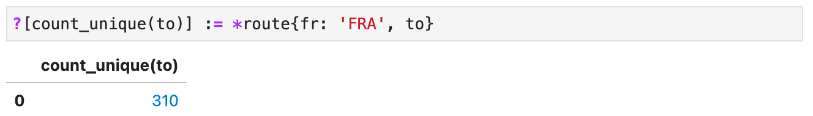
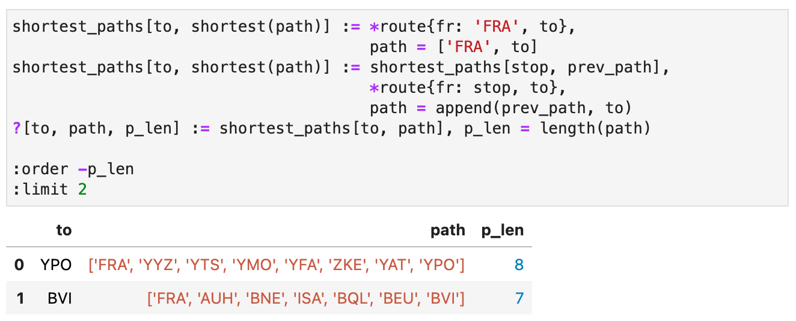
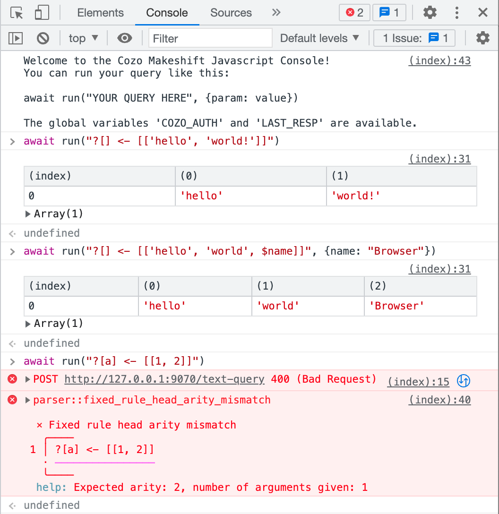

[](https://github.com/cozodb/cozo/actions/workflows/build.yml)
[](https://crates.io/crates/cozo)
[](https://github.com/cozodb/cozo/blob/main/LICENSE.txt)

# `cozo`

A general-purpose, transactional, relational database
that uses Datalog for query, is embeddable, and focuses on graph data and algorithms.

## Features

* Relational database with [Datalog](https://en.wikipedia.org/wiki/Datalog) as the query language
    * Recursive queries, recursion through (safe) aggregations, capable of expressing complex graph operations and
      algorithms
    * Fixed rules for efficient whole-graph algorithms which integrate seamlessly with Datalog
    * Rich set of built-in functions and aggregations
* Easy to use from any programming language, or as a standalone program
    * [Embeddable](https://cozodb.github.io/current/manual/setup.html#embedding-cozo), with ready-to-use bindings for
      Python, NodeJS and Java
    * Single executable standalone server, trivial to deploy and run
    * [Jupyter](https://jupyter.org/) notebooks integration, plays well with the DataScience ecosystem
* Modern, clean, flexible syntax, informative error messages

## Documentations

* [Installation and first queries](https://github.com/cozodb/cozo#install)
* [Tutorial](https://nbviewer.org/github/cozodb/cozo-docs/blob/main/tutorial/tutorial.ipynb)
* [Manual for CozoScript](https://cozodb.github.io/current/manual/)

## Teasers

Here `*route` is a relation with two columns `fr` and `to`,
representing a route between those airports,
and `FRA` is the code for Frankfurt Airport.

How many airports are directly connected to `FRA`?



How many airports are reachable from `FRA` by one stop?


How many airports are reachable from `FRA` by any number of stops?


What are the two most difficult to reach airports
by the minimum number of hops required,
starting from `FRA`?



What is the shortest path between `FRA` and `YPO`, by actual distance travelled?


Cozo attempts to provide nice error messages when you make mistakes:


## Install

As Cozo is an embedded database,
there are lots of options for installing it.
We aim to provide packaged distributions (binary when applicable) for the most common language/OS/arch combinations:

| Host language                                                                                                                                                            | OS  | Installation TL;DR                                                                                                                                                                                             | Details                                                              |
|--------------------------------------------------------------------------------------------------------------------------------------------------------------------------|-----|----------------------------------------------------------------------------------------------------------------------------------------------------------------------------------------------------------------|----------------------------------------------------------------------|
| Python 3.7+                                                                                                                                                              | B*  | `pip install "pycozo[embedded,pandas]"`,<br/>or `pip install "pycozo[embedded]"` if you don't want [Pandas dataframe](https://pandas.pydata.org/docs/reference/api/pandas.DataFrame.html) support              | [pycozo](https://github.com/cozodb/pycozo)                           |
| NodeJS 10+                                                                                                                                                               | B*  | `npm install --save cozo-node`                                                                                                                                                                                 | [cozo-node](https://github.com/cozodb/cozo-lib-nodejs)               |
| Clojure (with JDK 11+)                                                                                                                                                   | B*  | Use `com.github.zh217:cozo-clj` (maven repo: https://clojars.org/repo) in your package manager, [like this](https://clojars.org/com.github.zh217/cozo-clj)                                                     | [cozo-clj](https://github.com/cozodb/cozo-clj)                       |
| Java 11+                                                                                                                                                                 | B*  | Use `com.github.zh217:cozo-lib-java` (maven repo: https://clojars.org/repo) in your package manager, [like this](https://clojars.org/com.github.zh217/cozo-lib-java)                                           | [cozo-lib-java](https://github.com/cozodb/cozo-lib-java)             |
| Rust                                                                                                                                                                     | Any | Add `cozo = <VERSION>` to your Cargo.toml under `[dependencies]`                                                                                                                                               | [docs.rs](https://docs.rs/cozo)                                      |
| C/C++ or language with C FFI ([Go](https://pkg.go.dev/cmd/cgo), [Ruby](https://github.com/ffi/ffi), [Haskell](https://wiki.haskell.org/Foreign_Function_Interface), ...) | A*  | Use the [C header file](https://github.com/cozodb/cozo/blob/main/cozo-lib-c/cozo_c.h), and download the static/dynamic library `libcozo_c-*` from the [release page](https://github.com/cozodb/cozo/releases/) | [cozo-lib-c](https://github.com/cozodb/cozo/tree/main/cozo-lib-c)    |
| Standalone (HTTP server)                                                                                                                                                 | A*  | Download `cozoserver-*` for your system from the [release page](https://github.com/cozodb/cozo/releases/), uncompress, and run in a terminal                                                                   | [cozoserver](https://github.com/cozodb/cozo/blob/main/standalone.md) |

for the OS column:

* **B** includes:
    * Recent versions of Linux running on x86_64
    * Recent versions of MacOS running on ARM (M1/M2) and x86_64
    * Recent versions of Windows on x86_64
* **A** includes everything in **B**, and:
    * Recent versions of Linux running on aarch64

If a packaged distribution is not available for you, you can still compile
from source.

For embedded use, a single database directory can only be used by one process at any moment.
The database can be used from multiple threads within the single process and everything is thread-safe.
If you need multi-process access to a single database, use the standalone server.

Ease of installation is a priority for Cozo.
If you feel that something should be done to improve the current user experience,
please raise it [here](https://github.com/cozodb/cozo/discussions).

## Getting started

In this section we will learn to run three queries to illustrate how to use Cozo in each of the
supported language. We will run the queries against a local database with the relative path `_test_db`.

For all languages, the first query is a standard hello world:

```
?[] <- [['hello', 'world!']]
```

The second one illustrates the use of a named parameter `$name`:

```
?[] <- [['hello', 'world', $name]]
```

The third one contains an error, and illustrates how you get nice error messages printed out:

```
?[a] <- [[1, 2]]
```

### Python + Jupyter notebook (recommended)

You should already have JupyterLab installed, and have installed Cozo by `pip install "pycozo[embedded,pandas]"`.

Start your jupyter lab server, open the web UI, and start a Python 3 kernel.

In a cell, run

```
%load_ext pycozo.ipyext_direct
%cozo_path _test_db
```

this opens a local database with relative path `_test_db`.

To set the parameter for the second query, run

```
%cozo_set name 'Jupyter'
```

After that, just type queries in the cells and run them.
For more tricks, refer [here](https://github.com/cozodb/pycozo).

### Python

You should have Cozo installed by running `pip install "pycozo[embedded]"`.
The following scripts runs the three queries in turn:

```python
from pycozo import Client

db = Client(path='_test_db', dataframe=False)


def print_query(script, params=None):
    try:
        print(db.run(script, params))
    except Exception as e:
        print(repr(e))


print_query("?[] <- [['hello', 'world!']]")
print_query("?[] <- [['hello', 'world', $name]]", {"name": "Python"})
print_query("?[a] <- [[1, 2]]")
```

### NodeJS

You should have Cozo installed by running `npm install --save cozo-node"`.
The following scripts runs the three queries in turn:

```javascript
const {CozoDb} = require('cozo-node')

const db = new CozoDb('_test_db')

function printQuery(query, params) {
    db.run(query, params)
        .then(data => console.log(data))
        .catch(err => console.error(err.display || err.message))
}

printQuery("?[] <- [['hello', 'world!']]")
printQuery("?[] <- [['hello', 'world', $name]]", {"name": "JavaScript"})
printQuery("?[a] <- [[1, 2]]")
```

### Clojure

You should already have the package `com.github.zh217/cozo-clj` installed.
The following runs the three queries in turn (can be used in a repl):

```clojure
(use 'cozo-clj.core)
(in-ns 'cozo-clj.core)

(def db (open-db "_test_db"))

(iquery db "?[] <- [['hello', 'world!']]")
(iquery db "?[] <- [['hello', 'world', $name]]" {:name "Clojure"})
(iquery db "?[a] <- [[1, 2]]")
```

Use `query` instead of `iquery` if you are not using REPL.

### Java

You should already have the package `com.github.zh217:cozo-lib-java` in the maven repo `https://clojars.org/repo`
installed.
The following runs the three queries in turn:

```java
CozoDb db = new CozoDb("_test_db");
System.out.println(db.query("?[] <- [['hello', 'world!']]", ""));
System.out.println(db.query("?[] <- [['hello', 'world', $name]]", "{\"name\":\"Java\"}"));
System.out.println(db.query("?[a] <- [[1, 2]]", ""));
```

As Java does not have a standard JSON library, everything above uses strings.
In particular, you need to use your preferred JSON library to manipulate
the return values, or have the nice error message extracted, etc.

### Rust

You should already have `cozo = <VERSION>` in your `Cargo.toml`.

```rust
use cozo::Db;
use miette::Result;

fn main() -> Result<()> {
    let db = Db::new("_test_db")?;
    println!("{}", db.run_script_str(r#"db.query("?[] <- [['hello', 'world!']]"#, "")?);
    println!("{}", db.run_script_str(r#"db.query("?[] <- [['hello', 'world', $name]]"#, r#"{"name":"Rust"}"#)?);
    println!("{}", db.run_script_str(r#"db.query("?[a] <- [[1, 2]]"#, "")?);
}
```

This uses string for everything. Alternatively, you can use `db.run_script` instead and deal with `serde_json::Value`.
Refer to the [docs](http://docs.rs/cozo).

### C

Have the header file and static/dynamic library ready. Then

```c
#include <stdio.h>
#include <stdint.h>
#include <stdbool.h>
#include "cozo_c.h"

void run_query(int32_t db_id, const char *query, const char *params) {
    char *res;
    res = cozo_run_query(db_id, query, params);
    printf("%s\n", res);
    cozo_free_str(res);
}

int main() {
    int32_t db_id;
    char *err = cozo_open_db("_test_db", &db_id);

    if (err) {
        printf("%s", err);
        cozo_free_str(err);
        return -1;
    }

    run_query(db_id, "?[] <- [['hello', 'world!']]", "");
    run_query(db_id, "?[] <- [['hello', 'world', $name]]", "{\"name\":\"C\"}");
    run_query(db_id, "?[a] <- [[1, 2]]", "");

    cozo_close_db(db_id);

    return 0;
}
```

Everything above uses C-strings.
In particular, you need to use your preferred JSON library to manipulate
the return values, or have the nice error message extracted, etc.

### Standalone server

Download the standalone server `cozoserver-*` from the [release page](https://github.com/cozodb/cozo/releases/).
Uncompress and rename the executable `cozoserver` (or `cozoserver.exe` in Windows). In a terminal, run

```bash
./cozoserver _test_db
```

To execute queries, you need a HTTP client.
Send a POST request to `http://127.0.0.1:9070/text-query`
with the header `content-type: application/json`
and the body

```json
{
  "script": "?[] <- [['hello', 'world', $name]]",
  "params": {
    "name": "HTTP"
  }
}
```

In fact, if you use your browser to navigate to `http://127.0.0.1:9070` and open your developer tools,
you will be greeted with a very simple JS client:



## Learning CozoScript

Now you know how to run queries in your chosen language, you can start learning CozoScript:

* Start with the [Tutorial](https://nbviewer.org/github/cozodb/cozo-docs/blob/main/tutorial/tutorial.ipynb) to learn the
  basics;
* Continue with the [Manual](https://cozodb.github.io/current/manual/) for the fine points.

## Bug reports, discussions

If you encounter a bug, first search for [past issues](https://github.com/cozodb/cozo/issues) to see
if it has already been reported. If not, open a new issue.
Please provide sufficient information so that we can diagnose the problem faster.

Other discussions about Cozo should be in [GitHub discussions](https://github.com/cozodb/cozo/discussions).

## Use cases

As Cozo is a general-purpose database,
it can be used in situations
where traditional databases such as PostgreSQL and SQLite
are used.
However, Cozo is designed to overcome several shortcomings
of traditional databases, and hence fares especially well
in specific situations:

* You have a lot of interconnected relations
  and the usual queries need to relate many relations together.
  In other words, you need to query a complex graph.
    * An example is a system granting permissions to users for specific tasks.
      In this case, users may have roles,
      belong to an organization hierarchy, and tasks similarly have organizations
      and special provisions associated with them.
      The granting process itself may also be a complicated rule encoded as data
      within the database.
    * With a traditional database,
      the corresponding SQL tend to become
      an entangled web of nested queries, with many tables joined together,
      and maybe even with some recursive CTE thrown in. This is hard to maintain,
      and worse, the performance is unpredictable since query optimizers in general
      fail when you have over twenty tables joined together.
    * With Cozo, on the other hand, [Horn clauses](https://en.wikipedia.org/wiki/Horn_clause)
      make it easy to break
      the logic into smaller pieces and write clear, easily testable queries.
      Furthermore, the deterministic evaluation order makes identifying and solving
      performance problems easier.
* Your data may be simple, even a single table, but it is inherently a graph.
    * We have seen an example in
      the [Tutorial](https://nbviewer.org/github/cozodb/cozo-docs/blob/main/tutorial/tutorial.ipynb):
      the air route dataset, where the key relation contains the routes connecting airports.
    * In traditional databases, when you are given a new relation,
      you try to understand it by running aggregations on it to collect statistics:
      what is the distribution of values, how are the columns correlated, etc.
    * In Cozo you can do the same exploratory analysis,
      except now you also have graph algorithms that you can
      easily apply to understand things such as: what is the most _connected_ entity,
      how are the nodes connected, and what are the _communities_ structure within the nodes.
* Your data contains hidden structures that only become apparent when you
  identify the _scales_ of the relevant structures.
    * Examples are most real networks, such as social networks,
      which have a very rich hierarchy of structures
    * In a traditional database, you are limited to doing nested aggregations and filtering,
      i.e. a form of multifaceted data analysis. For example, you can analyze by gender, geography,
      job or combinations of them. For structures hidden in other ways,
      or if such categorizing tags are not already present in your data,
      you are out of luck.
    * With Cozo, you can now deal with emergent and fuzzy structures by using e.g.
      community detection algorithms, and collapse the original graph into a coarse-grained
      graph consisting of super-nodes and super-edges.
      The process can be iterated to gain insights into even higher-order emergent structures.
      This is possible in a social network with only edges and _no_ categorizing tags
      associated with nodes at all,
      and the discovered structures almost always have meanings correlated to real-world events and
      organizations, for example, forms of collusion and crime rings.
      Also, from a performance perspective,
      coarse-graining is a required step in analyzing the so-called big data,
      since many graph algorithms have high complexity and are only applicable to
      the coarse-grained small or medium networks.
* You want to understand your live business data better by augmenting it into a _knowledge graph_.
    * For example, your sales database contains product, buyer, inventory, and invoice tables.
      The augmentation is external data about the entities in your data in the form of _taxonomies_
      and _ontologies_ in layers.
    * This is inherently a graph-theoretic undertaking and traditional databases are not suitable.
      Usually, a dedicated graph processing engine is used, separate from the main database.
    * With Cozo, it is possible to keep your live data and knowledge graph analysis together,
      and importing new external data and doing analysis is just a few lines of code away.
      This ease of use means that you will do the analysis much more often, with a perhaps much wider scope.

## Status of the project

Cozo is very young and **not** production-ready yet,
but we encourage you to try it out for your use case.
Any feedback is welcome.

Versions before 1.0 do not promise syntax/API stability or storage compatibility.
We promise that when you try to open database files created with an incompatible version,
Cozo will at least refuse to start instead of silently corrupting your data.

## Plans for development

In the near term, before we reach version 1.0:

* Backup/restore functionality
* Many, many more tests to ensure correctness
* Benchmarks

Further down the road:

* More tuning options
* Streaming/reactive data
* Extension system
    * The core of Cozo should be kept small at all times. Additional functionalities should be in extensions for the
      user to choose from.
    * What can be extended: datatypes, functions, aggregations, and fixed algorithms.
    * Extensions should be written in a compiled language such as Rust or C++ and compiled into a dynamic library, to be
      loaded by Cozo at runtime.
    * There will probably be a few "official" extension bundles, such as
        * arbitrary precision arithmetic
        * full-text "indexing" and searching
        * relations that can emulate spatial and other types of non-lexicographic indices
        * reading from external databases directly
        * more exotic graph algorithms

Ideas and discussions are welcome.

## Storage engine

Cozo is written in Rust, with [RocksDB](http://rocksdb.org/) as the storage engine
(this may change in the future).
We manually wrote the C++/Rust bindings for RocksDB with [cxx](https://cxx.rs/).

## Licensing

The contents of this project are licensed under MPL-2.0 or later, except
files under `cozorocks/`, which are licensed under MIT, or Apache-2.0, or BSD-3-Clause.
